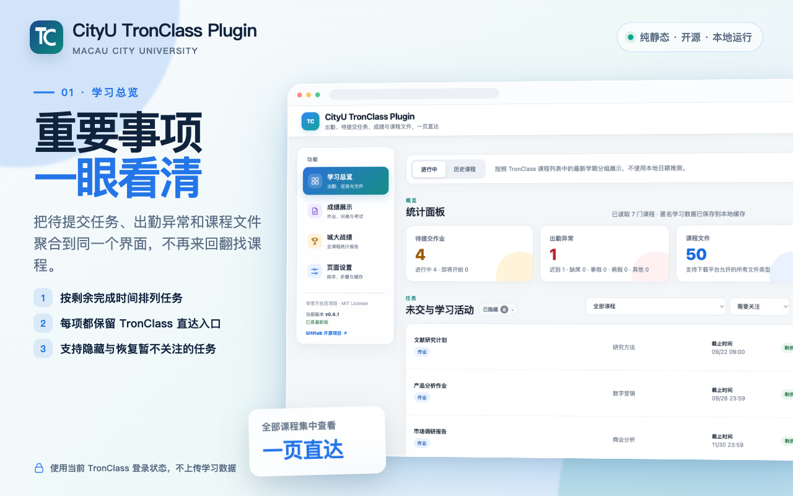
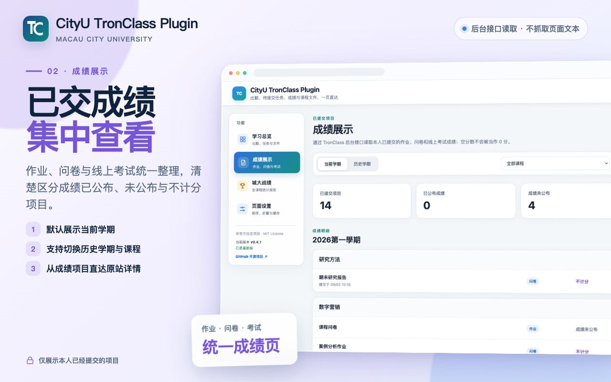
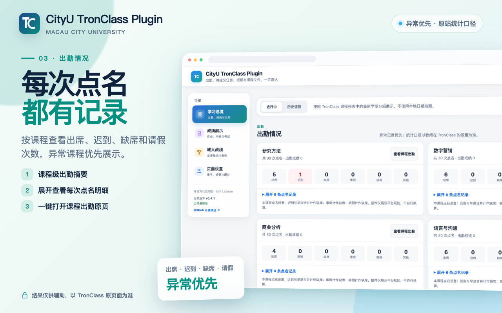
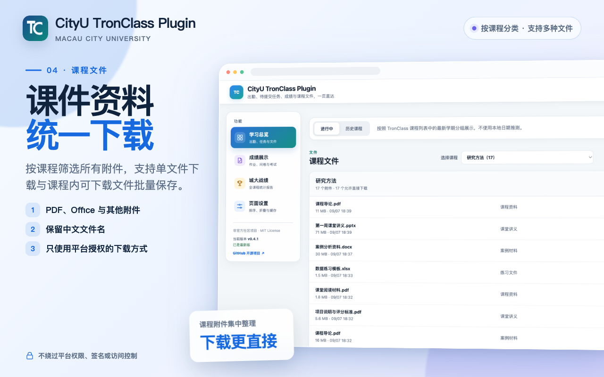
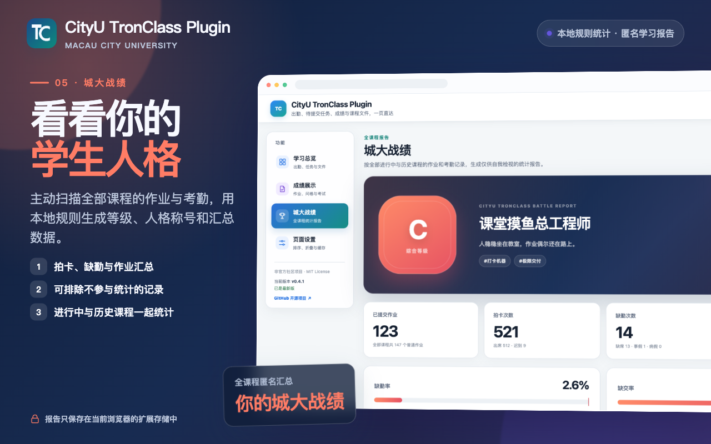

<div align="center">
  
  <h1>CityU TronClass Plugin</h1>
  <p><strong>面向澳门城市大学学生的非官方 TronClass 学习辅助Chrome插件</strong></p>
  <p>把出勤、待提交任务、成绩、学习活动和课程文件集中到一个清晰的 Dashboard。</p>

  <p>
    <a href="https://github.com/billylicn/cityu-tronplugin/releases/latest"></a>
    <a href="LICENSE"></a>
    
    
  </p>

  <p>
    <a href="https://chromewebstore.google.com/detail/llapladneeknmifggglonmcbaolgphdp?utm_source=item-share-cb"><strong>Chrome 商店安装</strong></a>
    ·
    <a href="#安装与使用"><strong>下载最新版</strong></a>
    ·
    <a href="#主要功能">主要功能</a>
    ·
    <a href="#隐私设计">隐私设计</a>
    ·
    <a href="privacy.html">完整隐私说明</a>
  </p>
</div>

> [!IMPORTANT]
> 本项目是非官方社区工具，与澳门城市大学、TronClass 或 Wisdom Garden Limited 无隶属或认可关系。聚合结果可能因平台接口、课程设置或网络状态出现漏报、错报、重复或延迟，请始终以 TronClass 原页面、课程通知和教师要求为准。

## 界面预览

<p align="center">
  <strong>一个页面，集中掌握课程中真正需要关注的信息</strong><br>
  <sub>以下截图均为匿名化示例；点击图片可查看原图。</sub>
</p>

<p align="center">
  <a href="images/store-screenshot-01-overview-1280x800.png">
<<<<<<< HEAD
    
  </a>
</p>

<table>
  <tr>
    <td width="50%" align="center">
      <a href="images/store-screenshot-02-grades-1280x800.png">
        
=======
    
  </a>
</p>

<table align="center" width="88%">
  <tr>
    <td width="50%" align="center">
      <a href="images/store-screenshot-02-grades-1280x800.png">
        
>>>>>>> f76e944 (update readme)
      </a>
      <br><strong>成绩展示</strong><br>
      <sub>集中查看已提交作业、问卷与线上考试成绩</sub>
    </td>
    <td width="50%" align="center">
      <a href="images/store-screenshot-03-attendance-1280x800.png">
<<<<<<< HEAD
        
=======
        
>>>>>>> f76e944 (update readme)
      </a>
      <br><strong>出勤情况</strong><br>
      <sub>按课程查看出席、迟到、缺席和请假记录</sub>
    </td>
  </tr>
  <tr>
    <td width="50%" align="center">
      <a href="images/store-screenshot-04-files-1280x800.png">
<<<<<<< HEAD
        
=======
        
>>>>>>> f76e944 (update readme)
      </a>
      <br><strong>课程文件</strong><br>
      <sub>按课程整理课件附件，提供授权下载入口</sub>
    </td>
    <td width="50%" align="center">
      <a href="images/store-screenshot-05-battle-1280x800.png">
<<<<<<< HEAD
        
=======
        
>>>>>>> f76e944 (update readme)
      </a>
      <br><strong>城大战绩</strong><br>
      <sub>汇总全部课程的作业与考勤，生成匿名等级报告</sub>
    </td>
  </tr>
</table>

## 主要功能

| 功能 | 说明 |
| --- | --- |
| **统计面板** | 汇总待提交作业、出勤异常、课程文件和逾期任务，并展示具体分类数量。 |
| **出勤情况** | 按课程查看出席、迟到、缺席、事假、病假及其他记录，支持直达课程出勤页。 |
| **作业与学习活动** | 聚合作业、讨论、问卷、线上测验、互动和分组学习，按剩余完成时间提示紧迫程度。 |
| **课程文件** | 按课程筛选课件和附件，下载平台允许获取的所有文件类型。 |
| **成绩展示** | 通过 TronClass 后台接口集中查看本人已提交的作业、问卷和线上考试成绩，支持当前学期与历史学期筛选。 |
| **城大战绩** | 统计全部课程的作业与考勤，生成等级报告，并允许手动排除记录。 |
| **个性化设置** | 调整栏目顺序和默认折叠状态、关闭自动刷新、忽略任务提示及清除匿名缓存。 |
| **版本更新提示** | 展示当前插件版本，并通过 GitHub Releases 检查是否有可下载的新版本。 |

## 安装与使用

### 从 Chrome 网上应用店安装（推荐）

1. 使用 Chrome 或其他兼容 Chromium 的浏览器打开 [CityU TronClass Plugin 商店页面](https://chromewebstore.google.com/detail/llapladneeknmifggglonmcbaolgphdp?utm_source=item-share-cb)。
2. 点击页面右上方的 **添加至 Chrome**。
3. 在浏览器确认窗口中点击 **添加扩展程序**。
4. 安装完成后，在同一浏览器中登录澳门城市大学 TronClass。
5. 点击浏览器工具栏中的扩展程序图标；如未显示，可先点击拼图按钮并固定 **CityU TronClass Plugin**。
6. 点击插件图标打开 Dashboard，即可查看出勤、待提交任务、成绩和课程文件。

> 通过 Chrome 网上应用店安装的版本通常会由浏览器自动更新，无需手动下载或删除旧版本。

### 从 GitHub Release 手动安装

1. 打开 [Releases 最新版本页面](https://github.com/billylicn/cityu-tronplugin/releases/latest)。
2. 在 **Assets** 中下载 `cityu-tronclass-plugin-vX.Y.Z.zip`。
3. 解压 ZIP；Chrome 不能直接加载压缩包。
4. 在 Chrome 地址栏打开 `chrome://extensions/`。
5. 开启右上角的 **开发者模式**。
6. 点击 **加载已解压的扩展程序**，选择解压后的目录。
7. 在同一浏览器中登录澳门城市大学 TronClass。
8. 点击工具栏中的扩展图标，打开 Dashboard。

> [!IMPORTANT]
> 更新时下载并解压新的 Release，然后在 `chrome://extensions/` 中移除旧版 CityU TronClass Plugin，再加载新版本目录。删除旧扩展会清除插件的本地缓存、页面布局和忽略设置，但不会修改 TronClass 原站中的课程、作业、考勤或文件数据。
<<<<<<< HEAD

### 从源码安装

```bash
git clone https://github.com/billylicn/cityu-tronplugin.git
cd cityu-tronplugin
npm test
npm run check
```

随后在 `chrome://extensions/` 中加载项目根目录。项目没有运行时依赖或构建步骤，修改后点击扩展的“重新加载”即可。
=======
>>>>>>> 414fe0e (update readme)

## 隐私设计

- 纯静态 Chrome Manifest V3 扩展，无后端，不上传学习数据。
- 仅请求 `tronclass.cityu.edu.mo`、`tcmedia.cityu.edu.mo`，以及用于检查公开 Release 版本的 `api.github.com`。
- GitHub 更新检查只读取公开 Release 版本号，不发送课程、身份或缓存数据。
- `chrome.storage.local` 只保存页面设置、经字段白名单处理的学习总览缓存、成绩缓存、匿名战绩缓存、记录排除状态，以及已忽略启动通知的 SHA-256 内容指纹。
- 不持久化姓名、学号、邮箱、内部用户 ID、Cookie、JWT、登录 bootstrap、请求头或其他身份字段。
- 不保存作答内容、问卷答案、提交记录 ID、教师评语、原始 API 响应、临时签名 URL、Blob、文件内容或下载内容。
- 自动刷新关闭后，打开插件、刷新页面或切换到无缓存课程范围时不会请求 TronClass。
- 使用声明默认每次打开时展示；用户可选择“不再展示”，该偏好只保存在浏览器本地，并可在页面设置中恢复。
- 启动通知由扩展内置静态内容提供；选择“忽略此通知”时只保存当前通知的内容指纹。标题、正文、按钮或链接变化后会作为新通知重新展示。
- 可在“页面设置”中重新显示已忽略通知，或清除匿名学习缓存；布局、折叠、自动刷新和声明展示偏好会保留。

详细说明见 [`privacy.html`](privacy.html)。

## 数据与功能边界

### 课程范围

扩展不使用电脑日期判断课程是否“进行中”。TronClass 课程列表按平台当前学期优先返回，扩展将与第一门有效课程具有相同 `semester.id` 的课程视为“进行中”，其余课程进入历史课程选择器。

### 成绩展示口径

- 成绩来自 TronClass 后台 API，不读取或解析课程页面 DOM、成绩文字或前端组件状态。
- 只展示平台确认已经提交的项目：作业依据提交状态，线上考试依据本人已提交考试列表，问卷依据本人提交状态或提交列表。
- `score: null` 或没有可见分数时显示“成绩未公布”，不会当作 0 分；明确不计分的问卷显示“不计分”。
- 插件只展示单项成绩和平台提供的权重，不计算课程总评、GPA，也不推测尚未公布的成绩。
- 默认学期由 TronClass 课程列表中的平台学期字段确定，不使用电脑日期推测；历史学期可在成绩页单独选择和读取。
- 成绩缓存只保留课程、活动标题、类型、可见分数、公布状态、权重、提交时间和正式直达地址，不保存答案、作答内容、提交记录 ID、教师评语或原始响应。

### 城大战绩统计口径

- 首次进入报告页不会自动扫描；点击“生成城大战绩”后，以最多 2 门课程并发读取全部课程的普通作业和个人考勤。
- 拍卡次数为出席加迟到；缺勤次数为缺席、事假和病假，未知状态不进入缺勤率分母。
- 缺交率只统计有明确截止时间、已经开放且截止时间已到的普通作业；每个作业活动只计算一次。
- 综合等级取缺勤率和缺交率中较高的风险；任一项达到 20% 时为 F。两项都没有有效分母时显示“暂无等级”。
- 缺勤或缺交记录可从统计口径中排除；排除后同步重新计算数字、比例和等级。


## 项目结构

```text
.
├── manifest.json           # Chrome Manifest V3 配置
├── background.js           # Dashboard、直达页面与下载调度
├── dashboard.html          # 主界面
├── dashboard.css           # 界面样式
├── dashboard.js            # 页面状态与交互
├── lib/                    # API、标准化、缓存、战绩和版本工具
├── tests/                  # Node.js 自动测试
├── privacy.html            # 隐私说明
└── .github/workflows/      # 自动 Release 工作流
```

## 开源许可与免责声明

本项目采用 [MIT License](LICENSE)，软件按“原样”提供。

平台接口、课程安排和教师设置可能随时变化，插件可能出现漏报、错报、重复、延迟或无法读取。作者及贡献者不为任何漏报、错报及其造成的签到、作业、考试、成绩或其他后果负责。使用者必须自行核对 TronClass 原页面、课程通知及教师要求，并对使用本软件作出的判断和行为承担责任。
